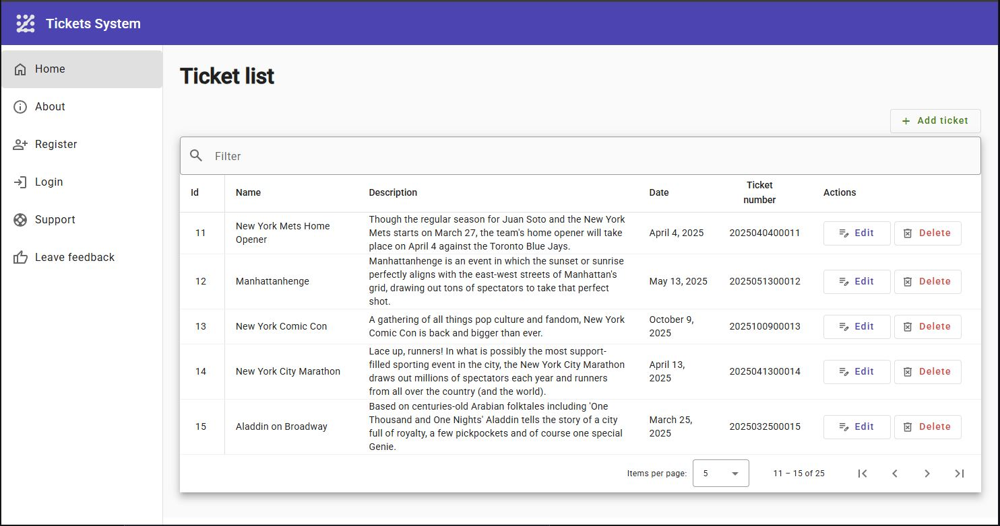
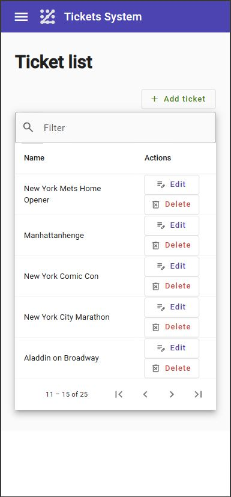
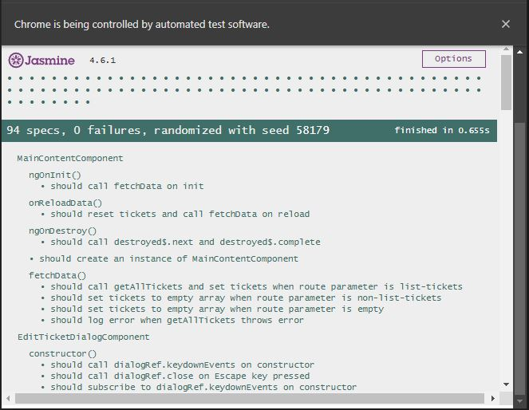
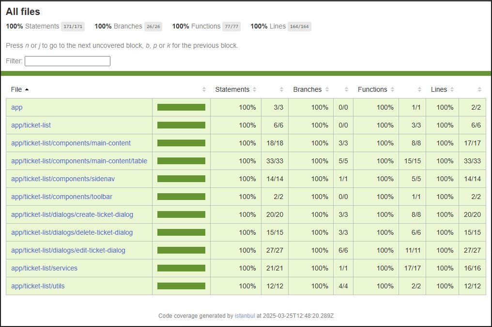

# Project Angular 17 - Ticket System UI Webapp
#### Author: Daniel Juarez

## Overview
This is a UI project of a real-world implementation for a fully functional feature of an event ticket system.

The author developed this UI project and a [backend API project](https://github.com/danljuarez/cSharp-RestAPI-NetCore-TicketList) (not included in this repository) to provide technical interviewers with an introduction to the author's experience working with Angular and C# for full-stack implementations.

The implementation of this Angular project aims to demonstrate approaches to:

**User interaction**
- Creating a user-friendly interface for users to interact with the ticket system.
- Implementing a responsive design to ensure the application works well on various devices and screen sizes.
- Displaying and updating data in real-time.
- Handling user input and validating data before submitting it to the backend API.
- Implementing a filter function to filter tickets by name, description, date, and more.
- Implementing column sort and pagination features provided by Angular Material.

**Angular Best Practices**
- Utilizing Angular's features to create a robust and maintainable application.
- Following TypeScript best practices.
- Using Angular CLI to scaffold the project and manage dependencies.
- Using Angular Material for UI components.
- Using Angular Router for routing.
- Using Angular Services for data management.
- Using Angular Observables for data streaming.
- Using Angular Reactive Forms for data validation.
- Using Angular Flex Layout for responsive design.
- Using Angular Animations for visual effects.

**Integration with backend API**
- Integration with a backend API to fetch and update data.
- Implementing API calls to create, read, update, and delete data.

**For unit tests**
- Implementing Isolated Unit Tests using Karma/Jasmine.
- Implementing Code Coverage using Istanbul.

This project was generated with [Angular CLI](https://github.com/angular/angular-cli) version 17.0.10.

## This project works in conjunction with
- A [backend API](https://github.com/danljuarez/cSharp-RestAPI-NetCore-TicketList) (not included in this repository) that handles data storage and retrieval: [cSharp-RestAPI-NetCore-TicketList](https://github.com/danljuarez/cSharp-RestAPI-NetCore-TicketList)
- A [microservice](https://github.com/danljuarez/cSharp-Azure-Functions-AddTickets) (not included in this repository) that can optionally be used to import multiple tickets into the backend API using Azure Functions V4: [cSharp-Azure-Functions-AddTickets](https://github.com/danljuarez/cSharp-Azure-Functions-AddTickets)


## To run this project
- **Version compatibility**<br/>
This webapp uses following compatible Angular tools version:

    | Angular| Node.js | TypeScript	| RxJS |
    | --- | --- | --- | --- |
    | 17.3.11 | 20.9.0	 | 5.2.2 | 7.8.1

- **Clear Angular CLI cache**<br/>
To clear the Angular CLI persistent disk cache, run the following command in your terminal:
    ```console
    ng cache clear
    ```

- **Install all npm components**<br/>
To install all npm components, run the following command in your terminal:
    ```console
    npm install
    ```
    or
    ```console
    npm i
    ```
    **Note**: At this time, ignore the `npm WARN deprecated` messages.

- **Build**<br/>
Run `ng build` to build the project. The build artifacts will be stored in the `dist/` directory.
    ```console
    ng build
    ```
    **Note**: At this time, ignore the `[WARNING]` message.

## Development server

Run `ng serve` for a dev server. Navigate to `http://localhost:4200/` in your preferred browser. The application will automatically reload if you change any of the source files.

**Note**: [Backend API](https://github.com/danljuarez/cSharp-RestAPI-NetCore-TicketList) (not included in this repository) that handles data storage and retrieval need to be running before the UI is executed: [cSharp-RestAPI-NetCore-TicketList](https://github.com/danljuarez/cSharp-RestAPI-NetCore-TicketList)

```console
ng serve
```

It will generate the following result in your browser:

**For Desktop:**



**For Mobile** (iPhone 12 Pro):




## Running unit tests

Run `ng test` to execute the unit tests via [Karma](https://karma-runner.github.io).
```console
ng test
```
or
```console
ng test --browsers=Chrome --watch
```
It will show following result:




## Run test-coverage
Run `ng test` to verify test coverage.
```console
ng test --no-watch --code-coverage
```
Look for `index.html` file in the following location:
```console
C:\<YourDrivePath>\Angular17-Ticket-List-WebApp\coverage\angular17-ticket-list-web-app\index.html
```
Open `index.html` in your preferred browser to see the results:



## Further help

To get more help on the Angular CLI use `ng help` or go check out the [Angular CLI Overview and Command Reference](https://angular.io/cli) page.

Thank You.
